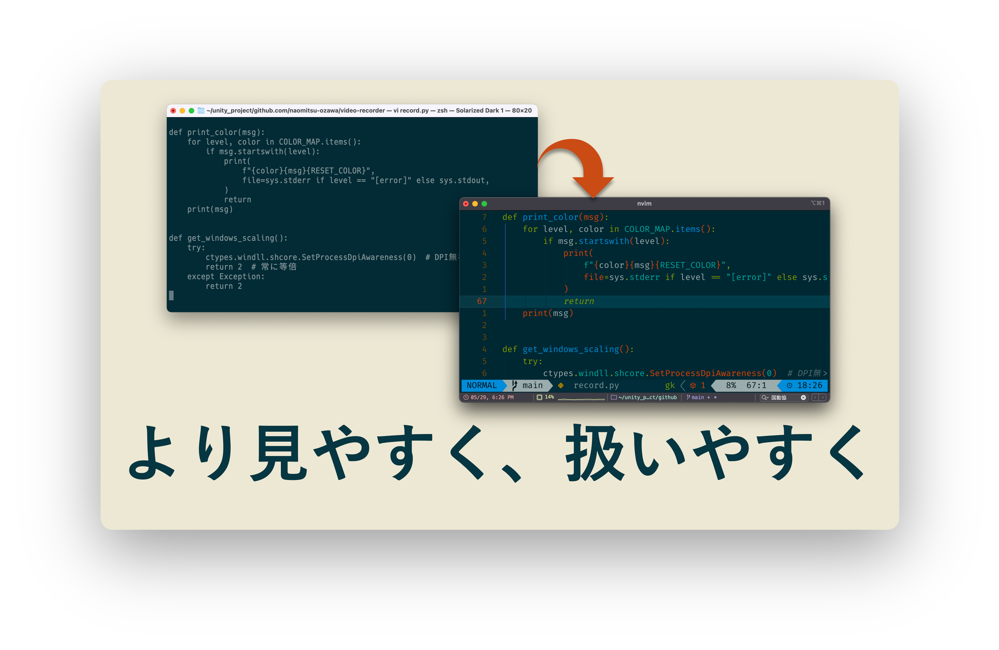

# CLI\_notes

A cross-platform CLI toolkit: dotfiles and tips for ClickMouseStudio

---

---
このリポジトリは、Linux / macOS / Windows（＋WSL）環境における
CLI 作業のための共通設定（dotfiles）や運用メモ（tips）を整理・共有することを目的としています。

ターミナルの操作に慣れていない方でも、使いやすい環境を整えられるように構成しています。

---

## 📁 ディレクトリ構成

* [common/](./common/) — OSに依存しない共通設定やNeoVimの構成
* [Ubuntu/](./Ubuntu/) — Ubuntu(Linux) 環境専用の dotfiles や tips
* [macOS/](./macOS/) — macOS（Apple Silicon）環境向け設定とツール構成
* [Windows/](./Windows/) — Windows / WSL 環境用の構成と補足情報

---

## 🚀 Quick Start

最短で環境を整える場合は、次の順序で読み進めてください。

1. OS 別ガイドを開く  
   - macOS: [macOS/README.md](./macOS/README.md)  
   - Ubuntu: [Ubuntu/README.md](./Ubuntu/README.md)  
   - Windows / WSL: [Windows/README.md](./Windows/README.md)
2. 共通設定を確認する  
   - [common/README.md](./common/README.md)
3. エディタ設定を適用する（任意）  
   - [common/NeoVim/README.md](./common/NeoVim/README.md)

環境を変更したら、最後に `git status` で追跡対象を確認してからコミットしてください。

---

## 🤝 Contributing

コントリビュート手順は [CONTRIBUTING.md](./CONTRIBUTING.md) を参照してください。
運用ルールの詳細は [AGENTS.md](./AGENTS.md) にまとめています。

---

> ターミナルの黒い画面と、無理なく友達になれるような環境づくりを目指しています。
